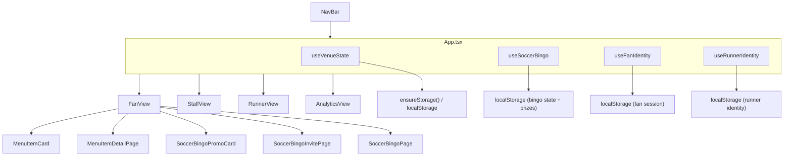

# VenueOne — Handover Document

**Last updated:** June 28, 2026  
**Prepared for:** Project continuity / next developer or stakeholder  
**Author:** Peculiar AI Labs (development session)

---

## 1. Executive Summary

**VenueOne** is a mobile-first stadium concession ordering demo for **Riverside Arena**. It simulates a full event-night operations stack in a single React SPA:

| Role | View | Purpose |
|------|------|---------|
| Fan | `fan` | Browse menu, customize items, order pickup or seat delivery, track status, play Soccer Bingo |
| Staff | `staff` | Kitchen queue — advance orders through prep stages |
| Runner | `runners` | Claim and deliver seat-delivery orders |
| GM | `analytics` | Live revenue, charts, runner stats, PDF recap export |

There is **no backend server** in this repo. All order data persists in the browser via a storage abstraction (`localStorage` by default). Multiple tabs on the same device share the venue ledger through a prefixed shared key.

---

## 2. Live & Source

| Resource | URL / Location |
|----------|----------------|
| **Production** | https://venueone.vercel.app |
| **GitHub** | https://github.com/smacgruder-web/VenueOne |
| **Local path** | `/Users/ll/Downloads/Peculiar App/VenueOne` |
| **Vercel project** | `venueone` (auto-deploys from `main`) |

**Latest commits on `main` (as of handover):**

```
00d4951 Pin all venue times to US Eastern (America/New_York)
e2daac0 Replace Soccer Bingo flip card with full-page invite flow
f9ca984 Add Soccer Bingo with header CTA, menu flip card, and prizes
a04a1fa Replace flip cards with full-screen item detail page
7a49a88 Mobile-first layout: bottom nav, safe areas, responsive grids
```

Working tree is **clean** — all session work is committed and pushed.

---

## 3. Tech Stack

| Layer | Choice |
|-------|--------|
| Framework | React 18 + TypeScript |
| Build | Vite 5 |
| Animation | Framer Motion |
| Styling | Tailwind CSS 4 (utilities) + `src/index.css` (component styles) + `src/styles/venueStyles.ts` (inline style objects for legacy views) |
| Icons | Lucide React (sparse use) |
| Storage | `window.storage` abstraction → `localStorage` fallback |
| Deploy | Vercel (static `dist/`) |

**Requirements:** Node.js 18+

```bash
npm install
npm run dev      # http://localhost:5173
npm run build    # tsc + vite build → dist/
npm run preview  # serve production build locally
```

---

## 4. Architecture



### State ownership

| Hook | Storage key | Scope |
|------|-------------|-------|
| `useVenueState` | `venue-ledger-v1` (shared) | Orders + event stats — synced across dashboard sessions on same device |
| `useFanIdentity` | `my-fan-state-v1` | Active order tracking, order history IDs |
| `useRunnerIdentity` | `my-runner-state-v1` | Selected runner name |
| `useSoccerBingo` | `venueone-soccer-bingo-v1`, `venueone-soccer-bingo-prizes-v1` | Board state + unclaimed prizes |

Auto-progress timers in `useVenueState` simulate kitchen/runner workflow (`src/utils/order.ts`, intervals in `src/config/app-config.ts`).

---

## 5. Key Files

### Entry & routing

| File | Role |
|------|------|
| `src/main.tsx` | React mount |
| `src/App.tsx` | View switcher, bingo modal state, hook wiring |
| `src/components/NavBar.tsx` | Top header + mobile bottom nav; Soccer Bingo CTA on fan view |

### Views

| File | Role |
|------|------|
| `src/views/FanView.tsx` | Primary fan UX — menu grid, cart, checkout, order tracking, bingo |
| `src/views/StaffView.tsx` | Kitchen order board |
| `src/views/RunnerView.tsx` | Delivery claim/dispatch |
| `src/views/AnalyticsView.tsx` | GM dashboard, charts, PDF recap |

### Menu & ordering

| File | Role |
|------|------|
| `src/data/constants.ts` | Menu items, sections, runners, `VENUE_TIMEZONE`, fees |
| `src/data/menuCustomizations.ts` | Per-item mod groups (size, toppings, etc.) |
| `src/components/MenuItemCard.tsx` | Grid card — tap photo/name opens detail; `+` is separate |
| `src/components/MenuItemDetailPage.tsx` | Full-screen item page with mods and add-to-cart |
| `src/utils/cartMods.ts` | Line keys, mod application, cart line formatting |
| `src/utils/menuRelated.ts` | "You might also like" suggestions |

### Soccer Bingo

| File | Role |
|------|------|
| `src/data/soccerBingo.ts` | Events, 5×5 board generation, win detection, prize types |
| `src/hooks/useSoccerBingo.ts` | Game state, sim play, prize claiming |
| `src/components/SoccerBingoPromoCard.tsx` | Menu grid promo (inserted after 2nd food item) |
| `src/components/SoccerBingoInvitePage.tsx` | Full-screen invite (mirrors menu detail layout) |
| `src/components/SoccerBingoPage.tsx` | Full-screen game board |
| `public/images/soccer-ball.png` | Promo + invite hero image |

**Deleted:** `src/components/SoccerBingoFlipCard.tsx` — removed in favor of full-page flow.

### Utilities & config

| File | Role |
|------|------|
| `src/utils/format.ts` | Money, time (Eastern), IDs |
| `src/utils/analytics.ts` | Bucket charts, CSV export, PDF recap HTML |
| `src/lib/storage.ts` | Storage API shim |
| `src/config/app-config.ts` | Feature flags, auto-progress intervals |
| `src/index.css` | Global + component CSS (menu cards, bingo, live badge, safe areas) |

---

## 6. Fan Ordering Flow

1. Fan lands on menu (`FanView`) — section 103 by default.
2. **Pickup** or **Seat Delivery** (+$2.50 fee) selected before ordering.
3. Tap food photo or name → `MenuItemDetailPage` (full screen, not in-card flip).
4. Customizations applied per line item; `+` on grid card quick-adds with current mods.
5. Checkout sheet → place order → status tracking screen with toast notifications.
6. **Reorder** available after pickup ready or delivery complete.

### Cart & prizes

- Cart lines keyed by `itemId + mod selections` (`buildCartLineKey`).
- Soccer Bingo prizes auto-apply at checkout:
  - `free_delivery` — waives $2.50 delivery fee
  - `five_off` — `Math.min(5, itemsTotal)` off food/drinks (caps at cart subtotal)
- Prize claimed on order submit via `claimPrize()`.

---

## 7. Soccer Bingo Flow

```
Promo card or header "⚽ Soccer Bingo"
        ↓
SoccerBingoInvitePage (full screen)
        ↓  [Play Now]
SoccerBingoPage (game)
        ↓  [5 in a row]
Prize stored → auto-applies on next checkout
```

- Promo card inserted in food grid after the **2nd food item** (`FanView.tsx` flatMap).
- Header CTA in `NavBar` switches to fan view and opens invite.
- **Sim Live Match Play** button marks random matching cells for demo/testing.
- Board center cell (index 12) is FREE and always marked.

**Prize types** (`src/data/soccerBingo.ts`):

| Type | Label | Checkout effect |
|------|-------|-----------------|
| `free_delivery` | Free Seat Delivery | Delivery fee → $0 |
| `five_off` | $5 Off Coupon | Up to $5 off items subtotal |

---

## 8. Timezone

All displayed times use **US Eastern** regardless of device timezone:

- Constant: `VENUE_TIMEZONE = 'America/New_York'` in `src/data/constants.ts`
- Formatters: `fmtTime`, `fmtLiveVenueTime`, `fmtDateTime` in `src/utils/format.ts`
- **LIVE badge** (`LiveEventBadge.tsx`): ticks every second — e.g. `LIVE · 8:31 PM EDT`
- Staff clock, order history, analytics buckets, CSV/PDF exports — all Eastern

---

## 9. Mobile UX (completed work)

These were explicit user-driven fixes during the build session:

| Issue | Fix |
|-------|-----|
| iPhone 12 menu overlap / hidden `+` | Caption bar layout, separate info CTA vs add button |
| Food photos cropped (top half only) | `object-fit: cover`, full-card photo, compact caption overlay |
| Small in-card flip for menu/bingo | Replaced with full-screen pages (`MenuItemDetailPage`, `SoccerBingoInvitePage`) |
| Bottom nav safe areas | `env(safe-area-inset-*)` on header and bottom nav |
| LIVE badge static/broken | Real Eastern wall clock with pulse dot |

---

## 10. Styling Conventions

The codebase uses a **hybrid** approach (intentional, not fully migrated):

- **Newer components** (menu cards, bingo, nav): Tailwind classes + `src/index.css`
- **Older views** (staff, runner, analytics sheets): `src/styles/venueStyles.ts` inline `CSSProperties`

When extending UI, match the pattern of the file you're editing. Menu and fan-facing surfaces prefer `index.css` + Tailwind.

---

## 11. Assets

| Path | Contents |
|------|----------|
| `public/images/menu/*.jpg` | Menu item photos (versioned via `MENU_IMG_VERSION` in constants) |
| `public/images/soccer-ball.png` | Soccer Bingo branding |
| `public/images/hero-*.jpg` | Legacy hero assets (FoodHero uses menu images now) |
| `branding/` | Brand assets |
| `VenueOne.jsx` | Legacy standalone file — **not** the active entry point (`src/App.tsx` is) |

---

## 12. Deployment

**Vercel** deploys automatically on push to `main`.

```bash
git push origin main   # triggers production deploy
```

Local Vercel link metadata lives in `.vercel/` (gitignored). No environment variables are required for the current static build.

Build output: `dist/` (Vite default).

---

## 13. Known Limitations

| Area | Limitation |
|------|------------|
| Persistence | Browser-only; no real multi-device sync without wiring `window.storage` to a cloud backend |
| Auth | None — anyone can access staff/runner/analytics views |
| Soccer Bingo | Simulated events only; no live sports data feed |
| `$5 Off` prize | Discount capped at cart subtotal (`Math.min(5, itemsTotal)`) — a $4 cart gets $4 off, not $5 |
| Order simulation | Auto-progress timers are demo shortcuts, not real kitchen integration |
| `api-config.ts` | GCS backup URLs configured but not actively used in the static demo |

---

## 14. Suggested Next Steps

Priority ideas for the next developer:

1. **Real-time sync** — Replace `localStorage` shared ledger with WebSocket or Cloudflare Durable Objects for true multi-device staff/fan sync.
2. **Live sports feed** — Wire Soccer Bingo events to a match API instead of `simPlay`.
3. **Prize rules** — Clarify whether `$5 Off` should always be $5 (store credit) vs. capped to order total.
4. **Style consolidation** — Migrate `venueStyles.ts` inline styles to Tailwind + CSS for consistency.
5. **Auth / role gating** — Restrict staff/runner/analytics views in production.
6. **PWA** — Add service worker for offline menu browsing at venue.

---

## 15. Related Projects

| Project | Path | Notes |
|---------|------|-------|
| **Baseball Bingo (source)** | `/Users/ll/CITA Apps/Baseball Bingo/stitch_interactive_baseball_bingo` | Original bingo UI inspiration; converted to soccer for VenueOne |
| **Peculiar branding** | `src/components/PeculiarLogo.tsx` | Logo in header |

---

## 16. Quick Reference — LocalStorage Keys

```
venue-shared:venue-ledger-v1          # Orders + stats (shared)
venue-local:my-fan-state-v1           # Fan session
venue-local:my-runner-state-v1         # Runner selection
venueone-soccer-bingo-v1               # Bingo board
venueone-soccer-bingo-prizes-v1        # Unclaimed prizes
```

Clear these in DevTools → Application → Local Storage to reset demo state.

---

## 17. Support Checklist for New Maintainer

- [ ] Clone repo, `npm install`, `npm run dev`
- [ ] Confirm https://venueone.vercel.app loads after any push
- [ ] Test fan flow on iPhone: menu photo → full detail → add → checkout
- [ ] Test Soccer Bingo: promo card → invite page → Play Now → win → prize at checkout
- [ ] Confirm LIVE badge shows Eastern time
- [ ] Review `src/config/app-config.ts` feature flags before production hardening
- [ ] Read this doc + `README.md`

---

*VenueOne — Riverside Arena · Peculiar AI Labs*